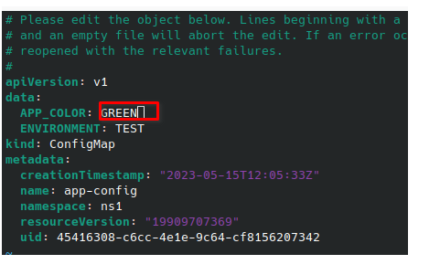

# Materials
**Finished code for this lesson is available on the Instance Tool at the folder /home/ubuntu/08-configmap/ .**
# Tasks
## Lifecycle Management
### Create a configmap
```
kubectl create configmap app-config --from-literal=APP_COLOR=BLUE --from-literal=ENVIRONMENT=TEST
```
 Using the from-file option the configmap could also be created using a file.
```
kubectl create configmap app-config-file --from-file=config.properties
```
### Retrieve configuration
```
kubectl get configmap app-config -o yaml
```

### Delete a configmap
```
kubectl delete configmaps app-config-file
```
## Configuration Injection
### As environment variable

We create here a pod on which we will inject the configmap (app-config) previously created as environment variables. The container displays the APP_COLOR and the target environment in its logs.
```
apiVersion: v1
kind: Pod
metadata:
 labels:
   app: pod-configmap-env
 name: pod-configmap-env
spec:
 containers:
 - image: busybox:latest
   name: pod-configmap-env
   command: [sh]
   args:
     - "-c"
     - "while true; do echo $APP_COLOR $ENVIRONMENT ; sleep 5;done" # We display here the message
   env:
    - name: APP_COLOR
      valueFrom:
        configMapKeyRef:
             name: app-config           # The ConfigMap this value comes from.
             key: APP_COLOR # The key to fetch.
    - name: ENVIRONMENT
      valueFrom:
        configMapKeyRef:
             name: app-config           # The ConfigMap this value comes from.
             key: ENVIRONMENT # The key to fetch.
```

```
kubectl create -f pod-configmap-env.yaml
```
- We display the log coming from configmap
```
kubectl logs pod-configmap-env -f
```


### As Volume
Here we  create a pod , on which configmap values will be mounted as volume. 
```
apiVersion: v1
kind: Pod
metadata:
 labels:
   app: pod-configmap-vol
 name: pod-configmap-vol
spec:
 containers:
 - image: busybox:latest
   name: pod-configmap-vol
   command: [sh]
   args:
     - "-c"
     - "sleep 4800" # We display here the message
   volumeMounts:
     - name: app-config
       mountPath: "/config"
       readOnly: true
 volumes:
 # You set volumes at the Pod level, then mount them into containers inside that Pod
 - name: app-config
   configMap:
     # Provide the name of the ConfigMap you want to mount.
     name: app-config
     # An array of keys from the ConfigMap to create as files
     items:
     - key: "APP_COLOR"
       path: "app_color.properties"
     - key: "ENVIRONMENT"
       path: "environment.properties"
```
```
kubectl create -f pod-configmap-volume.yaml
```
- We  display the content of the mounted files using kubectl exec.
```
kubectl exec -it pod-configmap-vol -- cat /config/app_color.properties
```


 When a ConfigMap currently consumed in a volume is updated, projected keys are eventually updated as well. The kubelet checks whether the mounted ConfigMap is fresh on every periodic sync. 
- Edit your configmap
```
kubectl edit configmap app-config
```

- Retrieve info from pod
```
kubectl exec -it pod-configmap-vol -- cat /config/app_color.properties
```
# Reference documentation
- [Config Map Official Documentation](https://kubernetes.io/docs/concepts/configuration/configmap/)