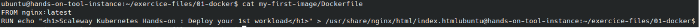
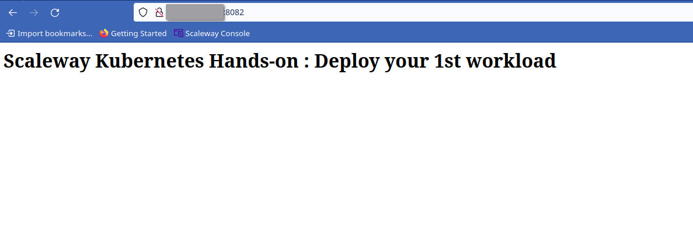

# Prerequisites
**Finished code for this lesson is available on the Instance Tool at the folder /home/ubuntu/exercice-files/exercice-files/01-docker/ .**
# Tasks

## Setup Validation
```
sudo docker version
```


## Run your 1st container
We will launch here a container that will rely on [Docker hello world image](https://hub.docker.com/_/hello-world) that just displays the Hello from Docker message.
```
sudo docker run hello-world
```


## Expose your 1st container
We will deploy here a container based on [nginx web server official image](https://hub.docker.com/_/nginx)

```
sudo docker run -p 80:80 -d  nginx:latest
```


- -p option binds port 80 of the container to port 80 on the machine itself
- --name specifies a name for the container
- -d runs the container in background (detached mode)

You should be able to reach your nginx container using your instance public ip and your local browser.


## Display all containers

Using the docker ps command , you can show the containers that are running.
```
sudo docker ps
```


Adding the "-a" option, you can even see all containers (running/down)
```
sudo docker ps -a
```


## Create your 1st docker image
We will use the nginx official image we used before to create our own image that will show a different homepage.

1. Open the exercice file folder <br/>
`cd /home/ubuntu/exercice-files/exercice-files/01-docker/`
1. Read the Dockerfile content <br/>
`cat my-first-image/Dockerfile`


3. Build your image
```
sudo docker build -t my-first-image my-first-image
```


4. Run a Container upon your Image
```
sudo docker run -p 8081:80 -d my-first-image
```
You should be able to reach your nginx container using your instance public ip on port 8081 and your local browser.


## Deploy your image on a Container registry (Scaleway container registry)
Each attendee project has been provisioned with a Scaleway Container Registry. A container registry holds images that are built as part of your project. 

 Environment variables used here have been pre provisioned to ease your work See [Attendee Environment](prerequisites#overview) 

1. Sign in to your container registry
```
sudo docker login $SCW_REGISTRY_ENDPOINT -u nologin --password-stdin <<< "$SCW_SECRET_KEY" 
```
1. Build and Tag your custom image
```
sudo docker build -t $SCW_REGISTRY_ENDPOINT/my-first-image:0.1 my-first-image
```
1. Push your custom image
```
sudo docker push $SCW_REGISTRY_ENDPOINT/my-first-image:0.1 
```
1. Run a container based on the pushed image
```
sudo docker run -p 8082:80 -d  $SCW_REGISTRY_ENDPOINT/my-first-image:0.1
```
You should be able to reach your nginx container using your instance public ip on port 8082 and your local browser.



# Reference Documentation
- [docker run documentation](https://docs.docker.com/engine/reference/commandline/run/)
- [docker build documentation](https://docs.docker.com/engine/reference/commandline/build/)
- [docker ps documentation](https://docs.docker.com/engine/reference/commandline/ps/)
