# Materials
**Finished code for this lesson is available on the Instance Tool at the folder /home/ubuntu/04-deployment/ .**
# Tasks
## Create a deployment
Here we use a yaml descriptor to create a deployment that manage a POC with one container.
```
kubectl create -f busy-deployment.yaml
```
<br/>
```
apiVersion: apps/v1
kind: Deployment
metadata:
 labels:
   app: busy-deployment
 name: busy-deployment
spec:
 replicas: 1
 selector:
   matchLabels:
     app: busy-deployment
 template:
   metadata:
     labels:
       app: busy-deployment
   spec:
     containers:
     - image: busybox:1.35.0
       name: busybox
       command: ["sh"]
       args: ["-c", "sleep 4800"]
```
<br/>

## Retrieve a deployment
- Get All deployments
```
kubectl get deployment
```
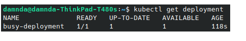
<br/>

 The **wide** output allows you to request for more details regarding the outputs of the request
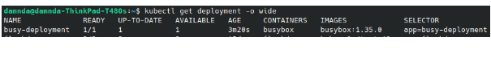
<br/>
```
kubectl get deployment -o json
```
<br/>

 The json/yaml outputs allows you  to retrieve all objects configuration respectively in json and yaml format.

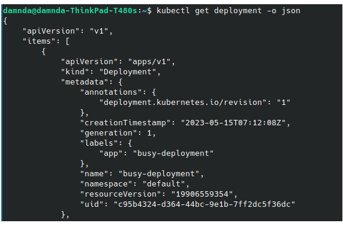

- Describe a deployment
```
kubectl describe deployment busy-deployment
```

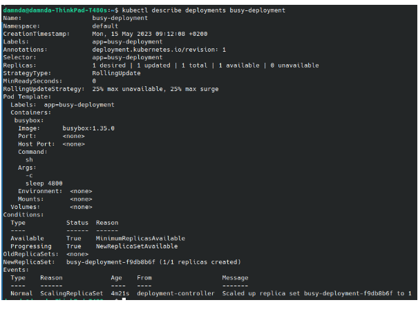

## Update a deployment
### Scale up/Scale Down
Here we will use the command line to shows the ability of the deployment to scale up/ down pods. 
<br/>

1. We start by displaying the current replicasets
```
kubectl get rs
```
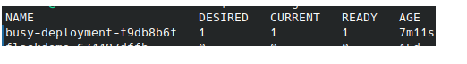
1. Then we can use the scale command to update the desired replicas.
```
kubectl scale --replicas=3 deployment/busy-deployment
```
 This can be achieved  by updating the replicas field within the yaml descriptor.

1. Finally we can look at the replicasets and the pods to check the results
```
kubectl get rs
```
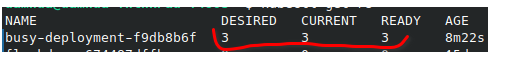
```
kubectl get pods
```
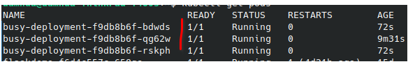

### Image update
1. We will update here the image that is used by the deployment, we will  move from busybox:**1.35.0** -> busybox:**1.36.0**.
```
kubectl set image  deployment/busy-deployment busybox=busybox:1.36.0
```
2. We then can look at the replicasets to ensure that they have been updated
```
kubectl get rs
```
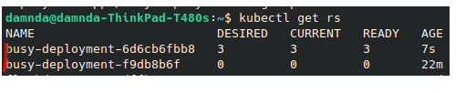
3. Finally , we could describe one of the current pod to validate the new pod characteristics
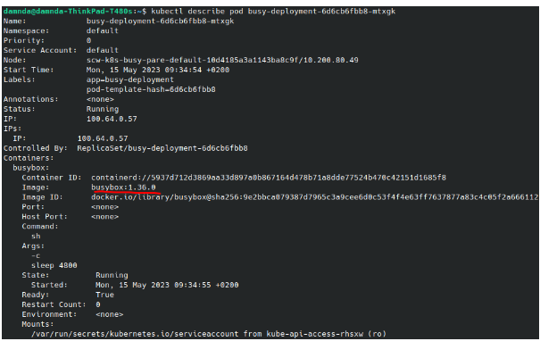
## Deployment rollout
This capability allows us to move between different versions of the deployment.
1. Show the history of the versions using **kubectl rollout history**
```
kubectl rollout history deployment/busy-deployment
```
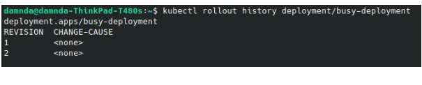
2. Then we can rollback to the previous version of the deployment that use the image **busybox:1.35.0** 
```
kubectl rollout undo deployment/busy-deployment
```
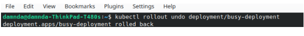
3. Finally , we can ensure that we rollbacked to the previous configuration by checking the deployment description
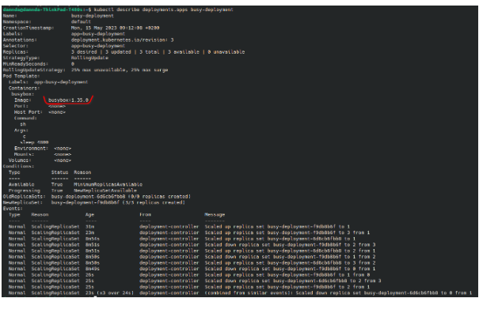

# Reference documentation
- [Kubectl Cheat Sheet](https://kubernetes.io/docs/reference/kubectl/cheatsheet/)
- [Kubernetes deployment documentation](https://kubernetes.io/docs/concepts/workloads/controllers/deployment/)
