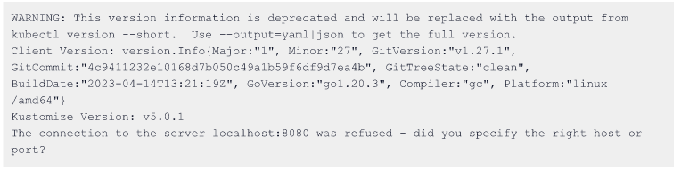
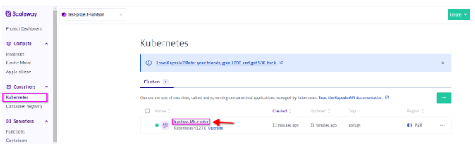
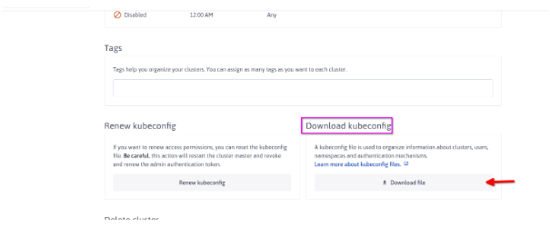
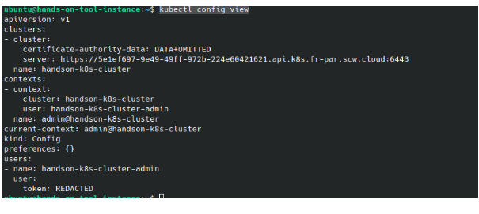
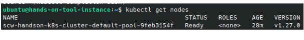
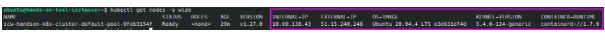
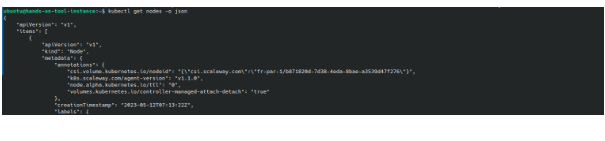

# Tasks
## Kubectl setup validation
```
kubectl version
```


## Kubectl configuration
The configuration files is needed to give connection information (API server url, token) to Kubectl.
It could be downloaded either from the Scaleway Console or using the Scaleway CLI.
### Downloading Using the console
1. Download the configuration file like in the following schemes


2. Use scp command or your favorite scp client to push the kubernetes configuration file from your local machine to the tool instance
```
scp -i ~/Downloads/private_key /home/damnda/Downloads/kubeconfig-handson-k8s-cluster.yaml ubuntu@${TOOL_PUBLIC_IP}:/home/ubuntu/.kube/config
```
- TOOL_PUBLIC_IP being the public IP of your dedicated tooling instance

### Downloading Using the Scaleway CLI
The tool instance have been provisionned with the [Scaleway CLI](https://github.com/scaleway/scaleway-cli/tree/master).
```
scw k8s kubeconfig get {cluster id} > ~/.kube/config
```
 You may use the auto completion feature that is enabled by default on the instance tool to get your cluster identifier.

### View Kubectl Configuration
We can check that the configuration have been correctly updated using the command below
```
kubectl config view
```


### Kubectl autocomplete enabling
Set up autocomplete in bash into the current shell, bash-completion package should be installed first.
```
source <(kubectl completion bash)
echo "source <(kubectl completion bash)" >> ~/.bashrc
```
## Display the List of nodes
Using Kubectl we can  retrieved the list of nodes currently used to deploy kubernetes workload.
```
kubectl get nodes
```
<br/>
 The **wide** output allows you to request for more details regarding the outputs of the request
```
kubectl get nodes -o wide
```
<br/>
 The json/yaml outputs allows you  to retrieve all objects configuration respectively in json and yaml format.
```
kubectl get nodes -o json
```


# Reference Documentation
- [Kubectl Cheat Sheet](https://kubernetes.io/docs/reference/kubectl/cheatsheet/)
- [Scaleway CLI](https://github.com/scaleway/scaleway-cli/tree/master)
- [Kubectl commands documentation](https://kubernetes.io/docs/reference/generated/kubectl/kubectl-commands)
