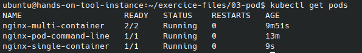
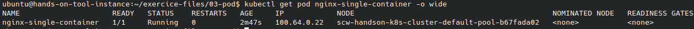
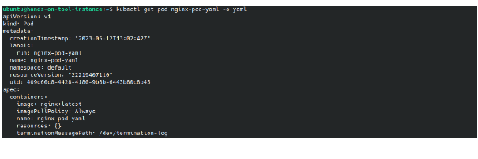
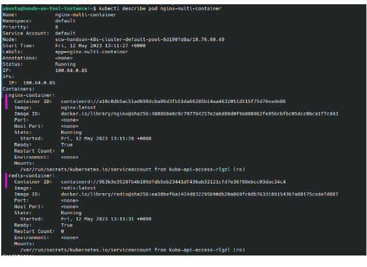
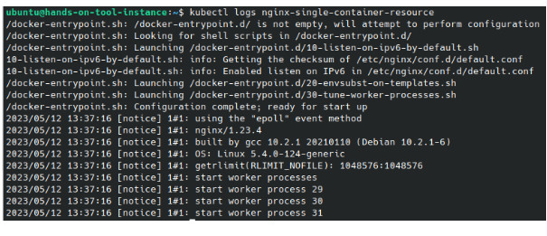
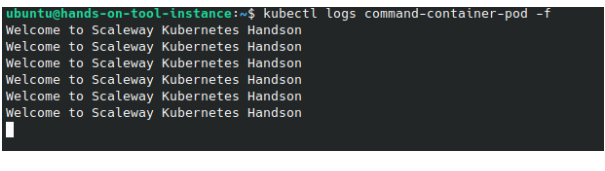
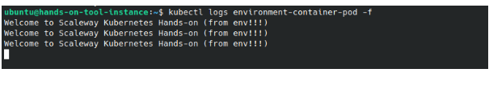
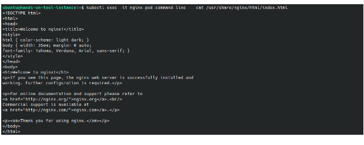
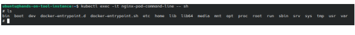
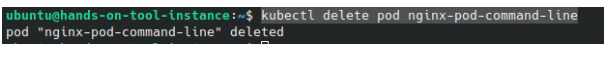

# Prerequisites
**Finished code for this lesson is available on the Instance Tool at the folder /home/ubuntu/exercice-files/03-pod/ .**
```
cd /home/ubuntu/exercice-files/03-pod/
```

# Tasks
## Create a single container pod
A POD can be created  using the command line or using a yaml file.
1. Command Line 
```
kubectl run nginx-pod-command-line --image=nginx:latest
```
2. Yaml Description

- We  use here the yaml file **/home/ubuntu/exercice-files/03-pod/single-container-pod.yaml**.

`cat single-container-pod.yaml`

- You can then create Kubernetes resources using that yaml descriptor.
```
kubectl create -f single-container-pod.yaml
```
 Using the dry-run capability of kubectl, you could generate  a spec for the pod and write it into a file 

```
kubectl run nginx-pod --image=nginx:latest  --dry-run=client -o yaml > nginx-pod.yaml
```
## Create a multi container pod
We  use here the yaml file **/home/ubuntu/exercice-files/03-pod/multi-container-pod.yaml**

`cat multi-container-pod.yaml`

```
kubectl create -f multi-container-pod.yaml
```
## Get Pods Information
- Get all pods
```
kubectl get pods
```
- Get a specific pod
```
kubectl get pod nginx-single-container 
```


<br/>

 The **wide** output allows you to request for more details regarding the outputs of the request
```
kubectl get pod nginx-single-container  -o wide
```


<br/>

 The json/yaml outputs allows you  to retrieve all objects configuration respectively in json and yaml format.
```
kubectl get pod nginx-single-container  -o json
```


- Describe pod

We can use the kubectl describe command to extract all information about a kubernetes resource  (here a pod).
```
kubectl describe pod nginx-multi-container
```

- Get logs 
```
kubectl logs nginx-single-container
```


## Configure POD

### POD Resources
We  use here the yaml file **/home/ubuntu/exercice-files/03-pod/single-container-pod-resources.yaml**

- `cat single-container-pod-resources.yaml`

```
kubectl create -f single-container-pod-resources.yaml
```
### Command and Args 
We  use here the yaml file **/home/ubuntu/exercice-files/03-pod/command-container-pod.yaml**

- `cat command-container-pod.yaml`

```
 kubectl create -f command-container-pod.yaml
```
- Show application logs

```
kubectl logs command-container-pod
```


### Environment variables injection

We  use here the yaml file **/home/ubuntu/exercice-files/03-pod/single-container-pod-resources.yaml**

- `cat environment-container-pod.yaml`

```
kubectl create -f environment-container-pod.yaml
```
- Show application logs

```
kubectl logs environment-container-pod
```


## Connect to a POD
We can rely on kubectl exec to connect to a pod or to trigger command from a pod.
It can be useful for debugging purpose (network issues, or image issue) or for utility purpose.
```
kubectl exec -it nginx-pod-command-line -- cat /usr/share/nginx/html/index.html
```
**NB** : With the command above, we read the content of the home page of one of the pod we previously deployed.


<br/>

 You can also use the exec command to launch a shell within the pod
```
kubectl exec -it nginx-pod-command-line -- sh
```

## Destroy a POD
```
kubectl delete pod nginx-pod-command-line
```


# Reference Documentation
- [Kubernetes Pod Official Documentation](https://kubernetes.io/docs/concepts/workloads/pods/)
- [Kubectl commands documentation](https://kubernetes.io/docs/reference/generated/kubectl/kubectl-commands)
