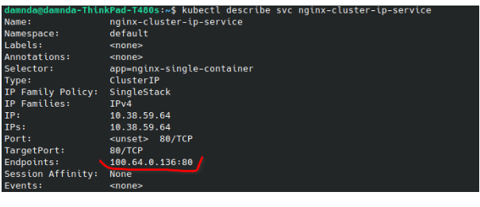
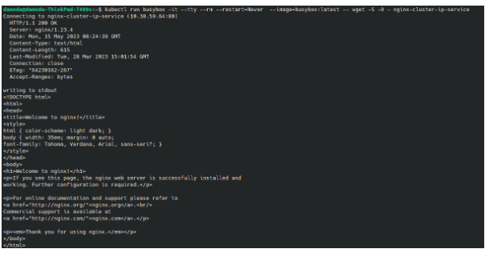
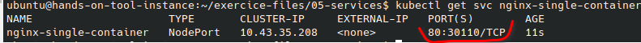
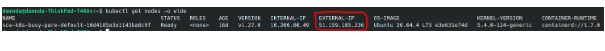
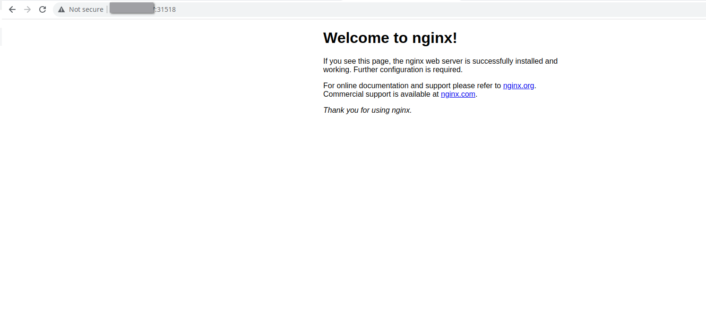
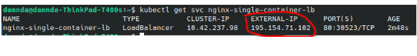
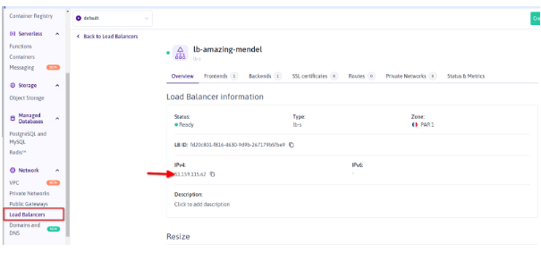
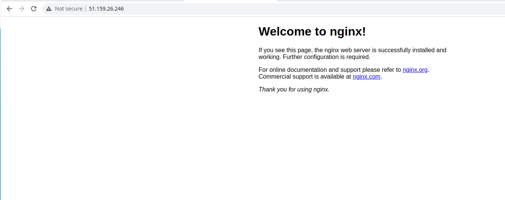

# Prerequisites
**Finished code for this lesson is available on the Instance Tool at the folder /home/ubuntu/exercice-files/05-services/ .**

```
cd /home/ubuntu/exercice-files/05-services/
```

# Tasks
## ClusterIP
### Create a Cluster IP
We  use here the yaml file **/home/ubuntu/exercice-files/05-services/clusterip-service.yml**

- `cat clusterip-service.yml`

```
kubectl create -f clusterip-service.yml
```


1. The service can be describe using the **kubectl describe** command
```
kubectl describe svc nginx-cluster-ip-service
```   


 The endpoints listed here are IP of the pod that are selected by the clusterIP selector. Having no endpoints means that either workload resources (pod, deployment, replicasets) are not deployed or incorrect configuration regarding the selector.
We can validate here using the following command

```
kubectl get pod nginx-single-container -o yaml | grep -i  podIp
```

3. We will launch an ephemeral pod to validate that the ClusterIP is reachable from the Kubernetes cluster
```
kubectl run busybox -it --tty --rm --restart=Never  --image=busybox:latest -- wget -S -O - nginx-cluster-ip-service
```


## NodePort
1. We can also create a service using the **kubectl expose** command 
```
kubectl expose pod nginx-single-container --type=NodePort --target-port=80 --port=80
```
- --type specifies the service type (NodePort/ClusterIP/LoadBalancer)
- --target-port refers to the port used to reach the service from the cluster
- --port  refers to the container port exposed by a pod or deployment

2. We can then get the service to have the port on which the service will be reached
```
kubectl get svc nginx-single-container 
```


3. We finally get the public ip on which our services will be available
```
kubectl get nodes -o wide # Find Node IP addresses
```


4. You just need to use your web browser to reach your service




## Load Balancer
1. We create the Loadbalancer  using the **kubectl expose** command 
```
kubectl expose pod nginx-single-container --name=nginx-single-container-lb --type=LoadBalancer --target-port=80 --port=80
```
2. The LoadBalancer resource leads to the creation of a Cloud Load balancer.
we can use the following command to retrieve the public IP of the load balancer
```
kubectl get svc nginx-single-container-lb
```

<br/>

Else you can retrieve it the scaleway console.


3. Finally you can access, your service using the public ip of your load balancer and a browser


# Reference documentation
[Kubernetes Services](https://kubernetes.io/docs/concepts/services-networking/)
