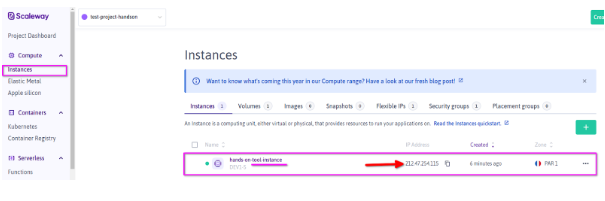

# Attendee Materials
A **Scaleway instance (Ubuntu)**  will be provided to each attendee with the following tools pre installed : 
- Docker
- Kubectl
- [Scaleway CLI](https://github.com/scaleway/scaleway-cli/tree/master)<br />
This Hands-on requires the attendee to have the software to establish a SSH connection with that instance on the default port 22. <br />
e.g.:
  - **Linux Based OS**
    - SSH client
    - scp client 
  - **Windows**
    - Putty
    - Kitty
    - Mobaxterm
    - …
  
# SSH Connection

1. Connect to your Scaleway Console 
2. Pick the project that is assigned to you according to the guide and information we previously provided
3. Retrieve Scaleway hands-on Tool instance (hands-on-tool-instance) public IP (See below)

4. Download your SSH keys Materials from the dedicated hands-on Object Storage (handson-${project_name}) i.e. : Prefix ssh_keys


5. Connect to your Scaleway instance using your SSH Client
- **Linux Based OS**
```
ssh -i ~/Downloads/private_key ubuntu@${TOOL_PUBLIC_IP}
```
**NB** : If you have error about permissions on the file you should execute the following command to update your private key permissions.
```
chmod 600 ~/Downloads/private_key
```
- **Windows Based OS**

**You may connect to your instance using your favorite SSH Client.**
