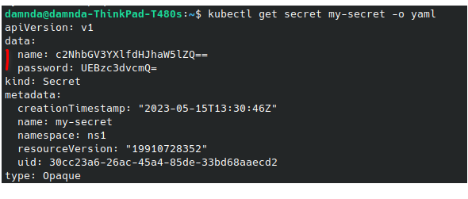
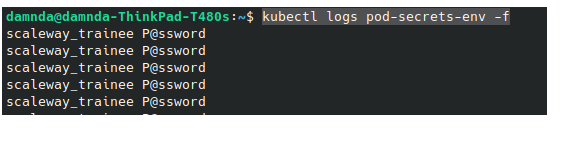
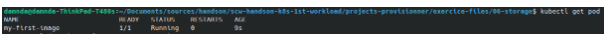
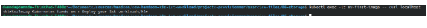

# Materials
**Finished code for this lesson is available on the Instance Tool at the folder /home/ubuntu/09-secret/ .**
# Tasks
## Lifecycle Management
### Create a secret
```
kubectl create secret generic my-secret --from-literal=name=scaleway_trainee --from-literal=password=P@ssword
```
### Read Secret
```
kubectl get secret my-secret
kubectl get secret my-secret -o yaml
```


 Secrets are not natively encrypted within kubernetes. Values are just base64 encoded . We could leverage jsonpath output from kubectl to extract one of the values of the secret and decode it using the base64 utility tool.
```
kubectl get secret my-secret -o jsonpath='{.data.name}'|base64 --decode
```
### Delete Secret
```
kubectl delete secret my-secret
```
## Secrets Injection
We first start by creating the secret that will be used. It hold data about user connection.
```
kubectl create secret generic db-secret --from-literal=app_username=scaleway_trainee --from-literal=app_password=P@ssword
```
### As environment variable
1. We create here a pod on which we will inject the secret (db-secret) previously created as environment variables. The container will only display the username and the password in its logs.
   
```
apiVersion: v1
kind: Pod
metadata:
  labels:
    app: pod-secrets-env
  name: pod-secrets-env
spec:
  containers:
  - image: busybox:latest
    name: pod-secrets-env
    command: [sh]
    args:
      - "-c"
      - "while true; do echo $APP_USERNAME $APP_PASSWORD ; sleep 5;done" # We display here the message
    env:
     - name: APP_USERNAME
       valueFrom:
         secretKeyRef:
              name: db-secret           # The ConfigMap this value comes from.
              key: app_username # The key to fetch.
     - name: APP_PASSWORD
       valueFrom:
         secretKeyRef:
              name: db-secret          # The ConfigMap this value comes from.
              key: app_password # The key to fetch.
```

```
kubectl create -f pod-secrets-env.yaml
```

2. We can then visualize the logs and ensure that the environment variables are the right one
   
```
kubectl logs pod-secrets-env -f
```



### As volume
1. Here we will create a pod , on which secret values will be mounted as volume. 

```
apiVersion: v1
kind: Pod
metadata:
  labels:
    app: pod-secrets-volume
  name: pod-secrets-volume
spec:
  containers:
  - image: busybox:latest
    name: pod-secrets-volume
    command: [sh]
    args:
      - "-c"
      - "sleep 4800" # We display here the message
    volumeMounts:
      - name: db-config
        mountPath: "/db-config"
        readOnly: true
  volumes:
  - name: db-config
    secret:
      secretName: db-secret
```
```
kubectl create -f pod-secrets-volume.yaml
```

2. We display the content of the mounted files using kubectl exec.

```
kubectl exec pod-secrets-volume -- cat /db-config/app_password
```

## Image Pull Secrets
In order to pull an image from a private container registry, kubernetes needs credentials. These credentials are stored as “Image Pull Secrets”.

 Environment variables used here have been pre provisioned to ease your work See [Attendee Environment](prerequisites#overview) 
<br/>
1. We first create the kubernetes secret with the username corresponding to the registry name and the password to our scaleway secret key (These data have already been generated in the instance tool as environment variables).
```
kubectl create secret docker-registry registry-secret --docker-server=${SCW_REGISTRY_SERVER} --docker-username=$SCW_REGISTRY_NAME --docker-password=$SCW_SECRET_KEY
```
1. We then indicate the new image when we create the workload object (pod, deployments, …).
```
kubectl run my-first-image --image=${SCW_REGISTRY_SERVER}/$SCW_REGISTRY_NAME/my-first-image:0.1
```

Our custom image being an nginx application, we could validate its deployment by looking for the welcome page.
```
kubectl exec -it my-first-image -- curl localhost
```


# Reference documentation
- [Kubernetes Secret](https://kubernetes.io/fr/docs/concepts/configuration/secret/)
- [Secret injection Tutorial](https://kubernetes.io/docs/tasks/inject-data-application/distribute-credentials-secure/)
- [Image Pull Secrets - Scaleway Tutorial](https://www.scaleway.com/en/docs/containers/kubernetes/how-to/deploy-image-from-container-registry/)
- [Image Pull Secrets - Official Kubernetes Tutorial](https://kubernetes.io/docs/tasks/configure-pod-container/pull-image-private-registry/)