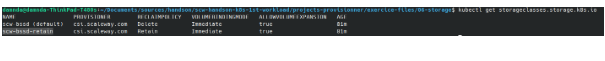
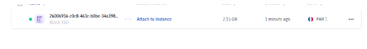
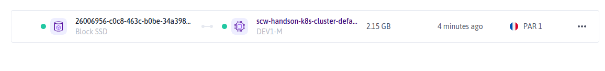

# Tasks
## Storage Classes

```
kubectl get sc
```

<br/>

 Scaleway Kapsule integrates with Scaleway CSI to natively allow dynamic provisioning of R/W only storages.

## Persistent Volume Claims
### Creation
It could be created using a yaml descriptor file like below

```
apiVersion: v1
kind: PersistentVolumeClaim
metadata:
 name: postgresql-pvc
spec:
 accessModes:
   - ReadWriteOnce
 storageClassName: scw-bssd-retain
 resources:
   requests:
     storage: 2Gi
```

```
kubectl create -f pvc.yaml
```
The block created is available but not yet attached to an instance as it is not claim by a pod.


### Retrieve a PVC
```
kubectl get pvc -o wide
```
### POD Attachment
We will use our PVC to claim storage for a postgres database. We rely on the following yaml descriptor to mount our volume in our pod.
```
apiVersion: apps/v1
kind: Deployment
metadata:
 labels:
   app: postgresql
 name: postgresql
spec:
 replicas: 1
 selector:
   matchLabels:
     app: postgresql
 template:
   metadata:
     labels:
       app: postgresql
   spec:
     containers:
     - image: postgres:latest
       name: postgresql
       env:
         - name: POSTGRES_PASSWORD
           value: P@ssword123
         - name: PGDATA
           value: /var/lib/postgresql/data/k8s
       volumeMounts:
         - mountPath: /var/lib/postgresql/data
           name: postgres-storage
     volumes:
       - name: postgres-storage
         persistentVolumeClaim:
           claimName: postgresql-pvc
---
apiVersion: v1
kind: Service
metadata:
 labels:
   app: postgresql
 name: postgres-svc
spec:
 ports:
 - port: 5432
   protocol: TCP
   targetPort: 5432
 selector:
   app: postgresql
 type: ClusterIP
```

```
kubectl create -f postgres-deployment.yaml
```
The volume is created and associated with an instance (see below.)


## Persistence Testing
We use here a psql client to ensure that the database information is stored and kept even after pod deletion. 
1. We create first a pod that holds a psql client using the following descriptor.

```
apiVersion: v1
kind: Pod
metadata:
 labels:
   run: psql-client
 name: psql-client
spec:
 containers:
 - image: jbergknoff/postgresql-client
   name: psql-client
   command:
     - "sh"
     - "-c"
     - "sleep 4800"
```
```
kubectl create -f psql-client.yaml
```

2. We connect to the database (using kubectl exec) and execute sql requests against our database
   
```
kubectl exec -it psql-client -- sh
psql -h postgres-svc -U postgres
CREATE TABLE CLOUD_PROVIDER(ID SERIAL PRIMARY KEY NOT NULL,NAME TEXT NOT NULL);
INSERT INTO CLOUD_PROVIDER(NAME) VALUES('scaleway');
```

3. Finally we delete the pod and ensure that the data we previously created remains.
   
```
kubectl delete pod postgresql*  #autocomplete could be used here to find the right pod
psql -h postgres-svc -U postgres
SELECT * from CLOUD_PROVIDER
```

# Reference documentation
[Persistent Volumes](https://kubernetes.io/fr/docs/concepts/storage/persistent-volumes/)
[Scaleway CSI](https://github.com/scaleway/scaleway-csi)
