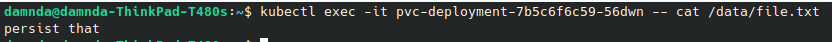

# Prerequisites
**Finished code for this lesson is available on the Instance Tool at the folder /home/ubuntu/exercice-files/07-storage/ .**

```
cd /home/ubuntu/exercice-files/07-storage/
```

# Tasks
## Storage Classes

```
kubectl get sc
```

<br/>

 Scaleway Kapsule integrates with Scaleway CSI to natively allow dynamic provisioning of R/W once storages.

## Persistent Volume Claims
### Creation
We  use here the yaml file **/home/ubuntu/exercice-files/07-storage/pvc.yaml**.

- `cat pvc.yaml`

```
kubectl create -f pvc.yaml
```
The block created is available but not yet attached to an instance as it is not claim by a pod.


### Retrieve a PVC
```
kubectl get pvc -o wide
```
### POD Attachment
1. We bound the PVC previously created as volume to our POD.
We  use here the yaml file **/home/ubuntu/exercice-files/07-storage/pvc-deployment.yaml**
<br/>
`cat pvc-deployment.yaml`
```
kubectl create -f pvc-deployment.yaml
```
The volume is created and associated with an instance (see below.)


2. We can now create a file within the volume 
```
kubectl exec -it pvc-deployment-7b5c6f6c59-bn228 -- sh -c 'echo persist in that file > /data/file.txt'
```

3. Finally file can be read 
```
kubectl exec -it pvc-deployment-7b5c6f6c59-56dwn -- cat /data/file.txt
```


## Persistence Testing
1. We  delete the POD(so the containers) to ensure that the volume have been kept and attached to the new pod.
```
kubectl delete pod pvc-deployment-7b5c6f6c59-56dwn
```
2. We ensure that on the new pod the data remains
```
kubectl exec -it pvc-deployment-7b5c6f6c59-x5cd2 -- cat /data/file.txt
```


# Reference documentation
[Persistent Volumes](https://kubernetes.io/fr/docs/concepts/storage/persistent-volumes/)
[Scaleway CSI](https://github.com/scaleway/scaleway-csi)
